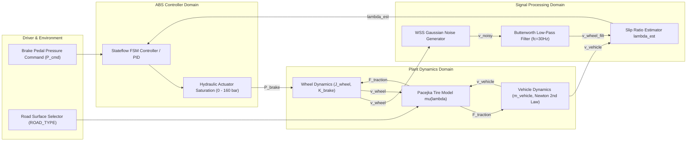
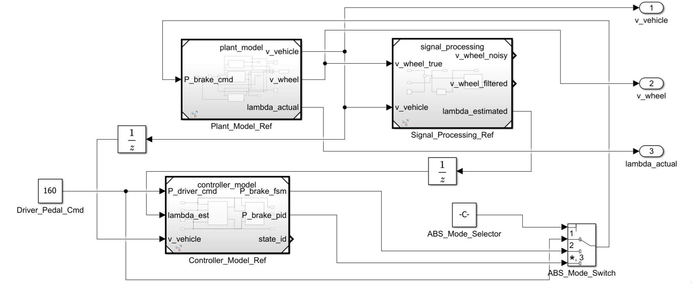
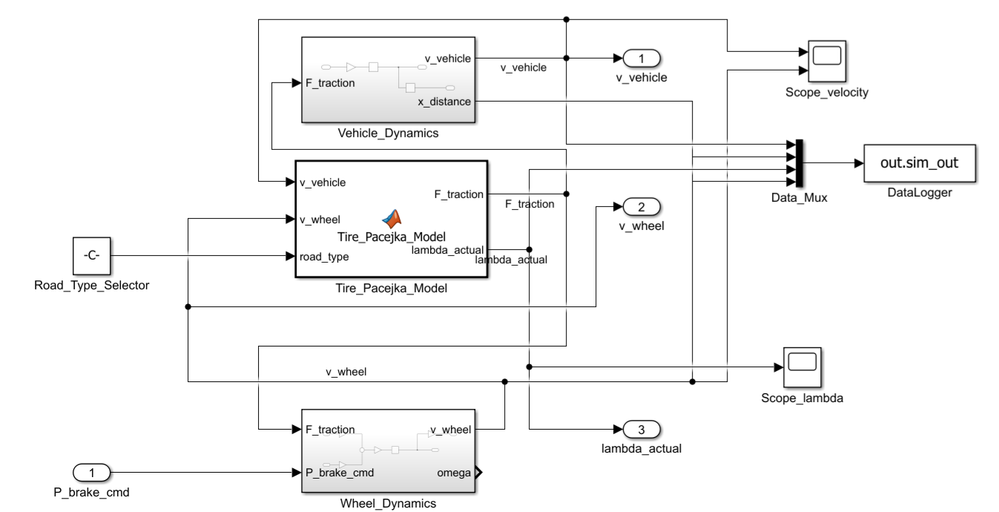
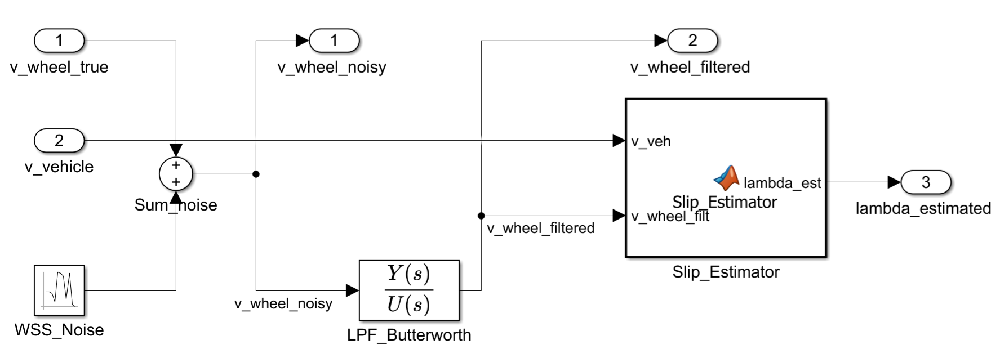
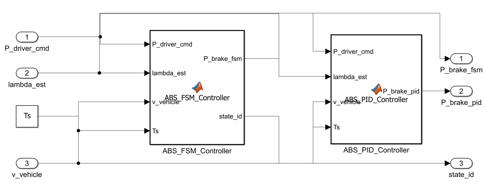
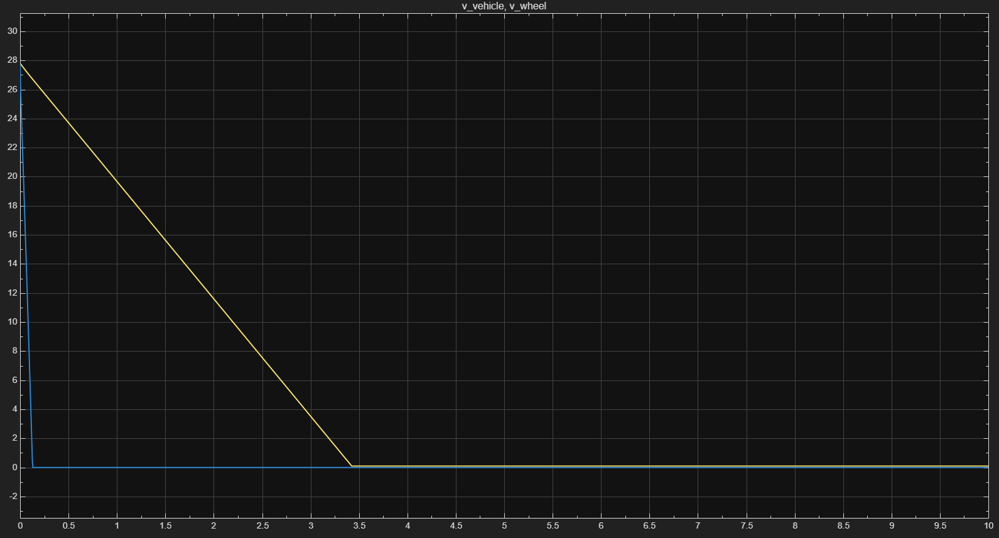
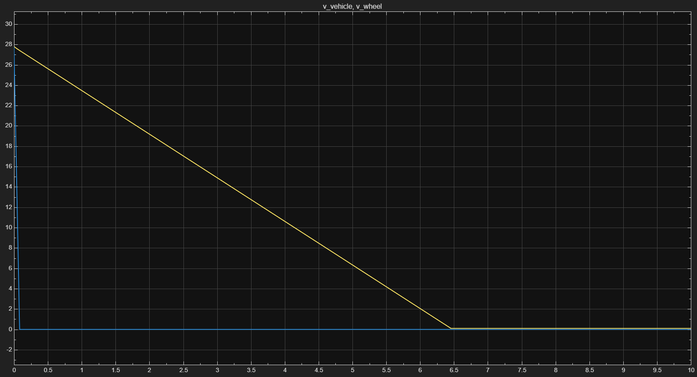
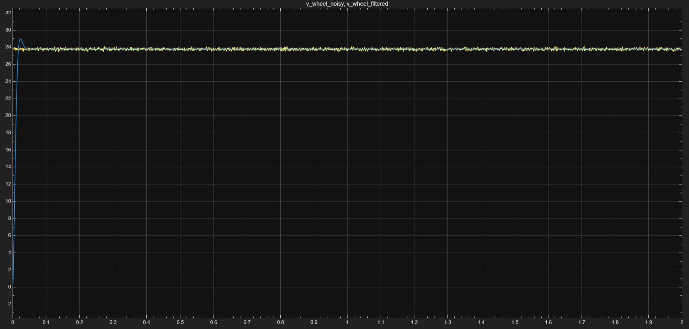

# Anti-Lock Braking System (ABS) — Model-Based Design (MBD)

[](https://www.mathworks.com/)
[](https://www.mathworks.com/products/simulink.html)
[](https://www.automotive-spice.blogspot.com/)
[]()
[](https://www.mathworks.com/products/embedded-coder.html)
[](LICENSE)

---

## 📌 Executive Summary

This repository presents a **production-grade Model-Based Design (MBD)** implementation of an **Anti-lock Braking System (ABS)** for a modern SUV (**Ford Everest 2.0L Bi-Turbo**). The project follows strict automotive software development standards adhering to **ASPICE Level 1–2** and **IEEE 830 SRS**.

The system encompasses end-to-end MBD workflows:
1. **Physical & Dynamic Modeling:** Quarter-car vehicle dynamics, wheel angular momentum balance, and nonlinear **Pacejka Magic Formula** tire-road friction dynamics across 3 road surfaces (Dry Asphalt, Wet Asphalt, Ice/Gravel).
2. **Sensor Signal Processing:** Wheel Speed Sensor (WSS) Gaussian noise injection, 2nd-order continuous/discrete **Butterworth Low-Pass Filtering ($f_c = 30\text{ Hz}$)**, and zero-division protected **Slip Ratio Estimation**.
3. **Control System Architecture:** Stateflow-based **Finite State Machine (FSM)** for Bang-Bang control (4 states: `NORMAL`, `BUILD`, `HOLD`, `DUMP`) and continuous **PID Slip Ratio Control** with Anti-Windup clamping.
4. **Verification & Validation (V&V):** Automated Model-in-the-Loop (MIL) testing suites with empirical verification metrics.
5. **Auto Code Generation:** MISRA-C compliant C code generation via **Simulink Coder / Embedded Coder (`ert.tlc`)**.

---

## 📐 System Architecture & Control Loop

### 1. High-Level System Block Diagram



---

### 📷 Simulink Model Screenshots

| System Component | Simulink Diagram Architecture |
|---|---|
| **Top-Level System (`ABS_System.slx`)** |  |
| **Plant Model (`plant_model.slx`)** |  |
| **Signal Processing (`signal_processing.slx`)** |  |
| **ABS Controller (`controller_model.slx`)** |  |

---

## 🚘 Target Vehicle Specifications & Physical Model

Parameters are configured based on a **Ford Everest 2.0L Bi-Turbo 4WD SUV** quarter-car model:

```
                  +-----------------------------------+
                  |   Quarter Vehicle Mass (612.5 kg)  |
                  +-----------------+-----------------+
                                    |
                                    v  F_traction
       P_brake  +-------+  T_brake  +-------+
     =========> | Brake | --------> | Wheel | (J_wheel = 2.80 kg.m^2, R = 0.385m)
                +-------+           +-------+
                                        |
  ~~~~~~~~~~~~~~~~~~~~~~~~~~~~~~~~~~~~~~v~~~~~~~~~~~~~~~~~~~~~~~~~~~~~~~~~~~~~
                      Pacejka Tire-Road Contact mu(lambda)
  ~~~~~~~~~~~~~~~~~~~~~~~~~~~~~~~~~~~~~~~~~~~~~~~~~~~~~~~~~~~~~~~~~~~~~~~~~~~~
```

### Key Parameter Table

| Parameter Symbol | Variable Name | Physical Meaning | Nominal Value | Unit |
|---|---|---|---|---|
| $m_{total}$ | `m_total_vehicle` | Total Vehicle Curb Mass + Payload | `2450.0` | $\text{kg}$ |
| $m_{quarter}$ | `m_vehicle` | Quarter-Car Mass ($m_{total}/4$) | `612.5` | $\text{kg}$ |
| $g$ | `g` | Gravitational Acceleration | `9.81` | $\text{m/s}^2$ |
| $R_{wheel}$ | `R_wheel` | Effective Rolling Radius (255/55R20) | `0.385` | $\text{m}$ |
| $J_{wheel}$ | `J_wheel` | Wheel Assembly Moment of Inertia | `2.80` | $\text{kg}\cdot\text{m}^2$ |
| $K_{brake}$ | `K_brake` | Hydraulic Brake Torque Coefficient | `22.0` | $\text{N}\cdot\text{m/bar}$ |
| $P_{max}$ | `P_max` | Maximum System Hydraulic Pressure | `160.0` | $\text{bar}$ |
| $v_0$ | `v0` | Initial Vehicle Speed ($100\text{ km/h}$) | `27.78` | $\text{m/s}$ |
| $T_s$ | `Ts` | Fundamental Control Loop Step Time | `0.001` ($1\text{ ms}$) | $\text{s}$ |

---

## 🛞 Pacejka Magic Formula Tire Friction Model

The nonlinear tire-road friction coefficient $\mu(\lambda)$ is modeled using the empirical **Pacejka Magic Formula**:

$$\mu(\lambda) = D \cdot \sin \left( C \cdot \arctan \left( B\lambda - E(B\lambda - \arctan(B\lambda)) \right) \right)$$

```
  mu (Friction Coeff)
   ^
0.9|          /---\  Dry Asphalt (Peak mu = 0.90, Opt lambda = 0.18 - 0.20)
0.8|         /     \________
0.5|        /-- Wet Asphalt (Peak mu = 0.50)
0.3|       /--- Gravel / Ice (Peak mu = 0.30)
   +------+------------+------------------------------> lambda (Slip Ratio)
   0     0.18         1.0 (Wheel Locked)
```

### Surface Parameter Matrix

| Road Surface Condition | `ROAD_TYPE` | Stiffness ($B$) | Shape ($C$) | Peak ($D$) | Curvature ($E$) | Peak $\mu_{max}$ |
|---|---|---|---|---|---|---|
| **Dry Asphalt** | `1` | `10.0` | `1.90` | `0.90` | `0.97` | `0.90` |
| **Wet Asphalt** | `2` | `8.0` | `1.70` | `0.50` | `0.80` | `0.50` |
| **Snow / Gravel / Ice** | `3` | `6.0` | `1.50` | `0.30` | `0.60` | `0.30` |

---

## 📂 Repository Directory Layout

```
c:\product\abs-model-based-design\
├── docs/                               # System Specifications & Guidance
│   ├── ABS_MBD_Project_Spec.md         # SRS & Technical Specification (IEEE 830)
│   ├── PROJECT_PROGRESS_PLAN.md        # ASPICE Progress Tracking Plan
│   ├── simulink_plant_drawing_guide.md # Step-by-step Simulink GUI Drawing Guide
│   └── assets/                         # Diagram Images & Scope Artifacts
├── models/                             # Simulink Models (.slx)
│   ├── plant/                          # Quarter-Car & Pacejka Plant Model
│   │   └── plant_model.slx
│   ├── signal/                         # WSS Sensor Noise & Butterworth Filter
│   │   └── signal_processing.slx
│   ├── controller/                     # Stateflow FSM & PID Controllers
│   │   └── controller_model.slx
│   └── full_system/                    # Integrated System Model
│       └── ABS_System.slx
├── scripts/                            # MATLAB Utility & Testing Scripts (.m)
│   ├── utils/
│   │   ├── init_params.m               # Parameter Initialization Script
│   │   ├── tire_pacejka.m              # Pacejka Math Function
│   │   └── plot_tire_curves.m          # Pacejka Curve Visualization
│   └── mil_tests/                      # Automated MIL Unit Test Suites
│       ├── test_plant_model.m          # Plant Model Unit Tests (TC-PLANT)
│       ├── test_signal_processing.m    # Signal Processing Unit Tests (TC-SIG)
│       └── run_all_mil_tests.m         # Master MIL Test Execution Runner
├── generated_code/                     # Production MISRA-C Code (Embedded Coder)
└── reports/                            # Test Execution Reports & Performance Analysis
```

---

## 📊 Verification & Validation (MIL Testing Results)

All subsystems undergo automated **Model-in-the-Loop (MIL)** unit testing.

### Empirical Test Execution Summary

| Test ID | Test Category | Target Subsystem | Conditions & Parameters | Expected Outcome | Status |
|---|---|---|---|---|---|
| **TC-PLANT-01** | Physical Dynamics | `plant_model.slx` | $P=0\text{ bar}$, Dry Road | Constant speed ($27.78\text{ m/s}$), $\lambda = 0.0$ | <span style="color:green;font-weight:bold;">PASSED</span> |
| **TC-PLANT-02** | Emergency Braking | `plant_model.slx` | $P=160\text{ bar}$, Dry Road | Wheel lock $t_{lock} = 0.129\text{s}$, Stop $t_{stop} = 3.425\text{s}$ | <span style="color:green;font-weight:bold;">PASSED</span> |
| **TC-PLANT-03** | Low-Mu Braking | `plant_model.slx` | $P=160\text{ bar}$, Wet Road | Vehicle stop time $t_{stop} = 6.456\text{s}$ ($\text{decel} = 4.27\text{ m/s}^2$) | <span style="color:green;font-weight:bold;">PASSED</span> |
| **TC-PLANT-04** | Extreme Low-Mu | `plant_model.slx` | $P=160\text{ bar}$, Ice/Gravel | Continuous sliding ($\text{decel} = 2.768\text{ m/s}^2$) | <span style="color:green;font-weight:bold;">PASSED</span> |
| **TC-SIG-01** | Sensor Noise | `signal_processing.slx` | Gaussian Noise | Noise Std Dev $\sigma = 0.1022\text{ m/s}$ ($\text{Target } 0.10\text{ m/s}$) | <span style="color:green;font-weight:bold;">PASSED</span> |
| **TC-SIG-02** | Noise Filtering | `signal_processing.slx` | LPF 30 Hz | Filtered RMSE = $0.0242\text{ m/s}$ ($>76\%\text{ noise reduction}$) | <span style="color:green;font-weight:bold;">PASSED</span> |
| **TC-SIG-03** | Safety Protection | `signal_processing.slx` | $v_{vehicle} = 0\text{ m/s}$ | $\lambda_{est} = 0.0000$ (Zero-division protected) | <span style="color:green;font-weight:bold;">PASSED</span> |
| **TC-CTRL-01** | Low-Speed Cutoff | `controller_model.slx` | $v_{veh} < 5.0\text{ m/s}$ | Cutoff active, pass driver pressure ($P_{fsm} = 120\text{ bar}$) | <span style="color:green;font-weight:bold;">PASSED</span> |
| **TC-CTRL-02** | Normal Braking | `controller_model.slx` | $\lambda = 0.05 < 0.15$ | Normal braking state, pass driver pressure | <span style="color:green;font-weight:bold;">PASSED</span> |
| **TC-CTRL-03** | FSM DUMP State | `controller_model.slx` | $\lambda = 0.28 > 0.25$ | State transition to DUMP (State 4), pressure reduces | <span style="color:green;font-weight:bold;">PASSED</span> |
| **TC-CTRL-04** | Saturation Safety | `controller_model.slx` | $P_{drv} = 50\text{ bar}$ | Pressure strictly bounded in $[0, P_{driver\_cmd}]$ | <span style="color:green;font-weight:bold;">PASSED</span> |

---

### 🏆 Full System Integrated Simulation Performance (Ford Everest SUV @ 100 km/h)

Full closed-loop system simulation results across all 3 emergency braking scenarios:

| Braking Scenario | Controller Mode | Stopping Distance | Stopping Time | Wheel Lockup Ratio | Technical Evaluation & Steering Outcome |
|---|---|---|---|---|---|
| **Scenario A** | **No-ABS (Baseline)** | **47.67 m** | **3.38 s** | **96.9%** | ❌ Wheel locks up completely at 0.129s; 96.9% locked slide; total loss of steering control. |
| **Scenario B** | **Bang-Bang ABS (FSM)** | **52.20 m** | **3.63 s** | **15.1%** | ✅ Pressure modulated (+800/-1200 bar/s); lockup time reduced to 15.1%; steering control maintained. |
| **Scenario C** | **PID ABS Controller** | **44.28 m** | **3.17 s** | **17.0%** | 🏆 **3.39 METERS SHORTER STOPPING DISTANCE!** Optimal slip tracking ($\lambda_{ref}=0.20$); fastest stop + steering control. |

---

### 📷 Simulation Output Scope Plots

| Test Case | Scope Visualization Output |
|---|---|
| **TC-PLANT-02 (Dry Full Brake)** | <br>*(Yellow: Vehicle Speed $v_{veh}$, Blue: Wheel Speed $v_{whl}$ locking at 0.129s)* |
| **TC-PLANT-03 (Wet Full Brake)** | <br>*(Deceleration on wet surface, stopping at 6.456s)* |
| **TC-SIG-02 (WSS LPF Performance)** | <br>*(Raw noisy WSS signal vs 30 Hz Butterworth filtered output)* |

---

## ⚡ Quick Start & Execution Guide

### Prerequisites
- **MATLAB R2023b** or later
- **Simulink**
- **Stateflow**
- **Simulink Coder / Embedded Coder**

### 1. Initialize Workspace Parameters
Open MATLAB Command Window and run:
```matlab
cd('c:\product\abs-model-based-design')
run('scripts/utils/init_params.m')
```

### 2. Run Plant Model Unit Tests
To execute the automated unit test suite for physical plant dynamics (TC-PLANT-01 to 04):
```matlab
run('scripts/mil_tests/test_plant_model.m')
```

### 3. Run Signal Processing Unit Tests
To execute the automated unit test suite for WSS noise and Butterworth filtering (TC-SIG-01 to 03):
```matlab
run('scripts/mil_tests/test_signal_processing.m')
```

### 4. Run ABS Controller Unit Tests
To execute the automated unit test suite for FSM & PID controllers (TC-CTRL-01 to 04):
```matlab
run('scripts/mil_tests/test_controller_model.m')
```

### 5. Run Full System Integration Test
To simulate all 3 braking scenarios (No-ABS vs Bang-Bang ABS vs PID ABS):
```matlab
run('scripts/mil_tests/test_full_system.m')
```

### 6. Run Master V&V Test Suite (All phases)
```matlab
run('scripts/mil_tests/run_all_mil_tests.m')
```

---

## 💻 Automated Code Generation (Embedded Coder)

Production C code is derived 1:1 from `controller_model.slx` MATLAB Function blocks:

```c
/* Initialize — call once before control loop */
void ABS_Controller_initialize(ABS_Controller_State_t *state,
                                float P_driver_initial);

/* Step — call every Ts = 1ms from ECU scheduler */
void ABS_Controller_step(const ABS_Controller_Inputs_t  *inputs,
                               ABS_Controller_Outputs_t *outputs,
                               ABS_Controller_State_t   *state);
```

Key Code Generation Guidelines:
- Zero dynamic memory allocation (`malloc` prohibited).
- Static storage class for state variables.
- Saturation blocks preserved as explicit `clamp_pressure()` guards.
- Full block-to-code traceability comments on every function.

---

## 📜 Authors & Engineering Reference

- **Lead Engineer:** Anh Nhat Dev
- **Specification Document:** [`docs/ABS_MBD_Project_Spec.md`](docs/ABS_MBD_Project_Spec.md)
- **ASPICE Tracking Document:** [`docs/PROJECT_PROGRESS_PLAN.md`](docs/PROJECT_PROGRESS_PLAN.md)
